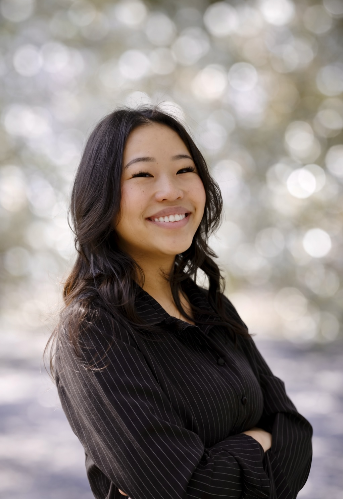

::: columns
::: {.column width="40%"}
{style="border-radius: 70%;"}
:::

::: {.column width="70%" style="padding-left: 3rem;"}
Behind every marketing campaign is someone making sure the contracts are signed, the budget holds, and nothing falls through the cracks. Welcome to my world!
:::
:::

During my time at **The Walt Disney Company**, my work has helped bring landmark campaigns to life — including ESPN and Disney's first-ever Super Bowl marketing campaign, *"[We're Going](https://thewaltdisneycompany.com/news/were-going-super-bowl-espn/),"* and Hulu's comedy-first brand moment, *"[Hularious.](https://thewaltdisneycompany.com/news/hularious-stand-up-comedy-hulu/)"*

Today, I bring that same execution-first mindset to **Microsoft**, where I support marketing procurement for their AI product portfolio — managing vendor strategy, agency partnerships, and sourcing across key tentpole events and high-visibility product launches.

## About Me

I hold a Bachelor's in Business Administration from the University of California, Riverside & and am currently pursuing my Master's in Digital Marketing at Cal Poly Pomona.

Outside of work & school, I enjoy trying new restaurants around Southern California, traveling, and making my daily matcha drink!

------------------------------------------------------------------------

*Let's connect on [LinkedIn](https://www.linkedin.com/in/ashleyxlee/)!*
