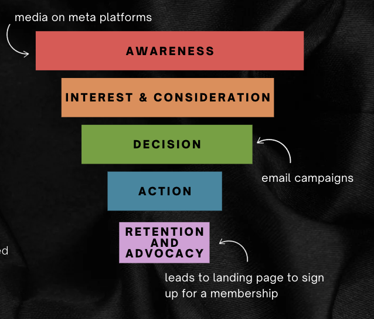
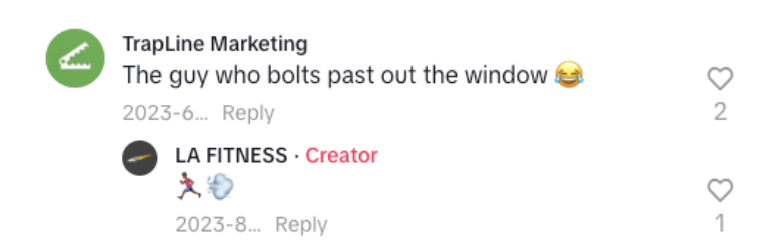
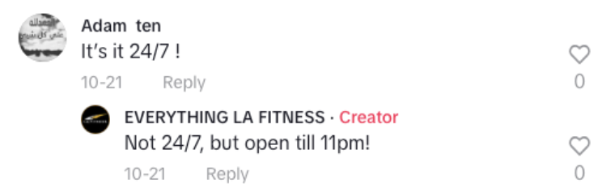

## **Project Overview**

**The Ask:** Develop, execute, and optimize a BETA program to drive high-intent leads and online sign-ups for select LA Fitness locations **during the critical pre-New Year period**, when gym sign-ups peak at 12%.

For my specific portion of this project, I focused on the following: determined KPIs, audience & persona, call-to-action (CTA), and social media strategy for this campaign.

::: columns
::: {.column width="50%"}
### **KPIs, Goals & Strategy:**

The primary KPIs include guest count, guest pass activations, and member sign-ups. To achieve these objectives, I analyzed how these strategies align with the marketing funnel.

Our determined strategy to drive leads and increase member sign-ups will be executed through **targeted media** and **email marketing campaigns**.
:::

::: {.column width="50%"}
### **Visual Strategy**

:::
:::

## LA Fitness's Persona & Audience

+------------------------------------------------------------------------+---------------------------------------------------------+
| Audience                                                               | LA Fitness Persona                                      |
+========================================================================+=========================================================+
| **Current LA Fitness Members**                                         | **Members Look Like the Following:**                    |
|                                                                        |                                                         |
| **Age**                                                                | -   Fitness enthusiasts                                 |
|                                                                        |                                                         |
| -   26.6% of customers are ages 18-34, with ages 65+ trailing \@ 20.5% | -   Social extroverts seeking group workouts            |
|                                                                        |                                                         |
| -   55-64, 45-54, and 35-44 make up the lowest share                   | -   Beginners exploring their fitness journey           |
|                                                                        |                                                         |
| **Location**                                                           | -   Loyal LA Fitness members eager to earn more rewards |
|                                                                        |                                                         |
| -   36 locations across Texas, mature clubs                            |                                                         |
+------------------------------------------------------------------------+---------------------------------------------------------+
| *Additional audience metrics not shared for client confidentiality.*   |                                                         |
+------------------------------------------------------------------------+---------------------------------------------------------+

## Call to Action - Holiday Campaign

**Share the Gift of Fitness and Enjoy Rewards Together— Double Your VIP Points and Gift 50% Off Initiation!**

The **intent** behind this campaign is to promote friendship, touch on the idea of **communication and connection** in our messaging, and tie these themes into the **wellbeing and resolution** for the new year. Engage community, wellness, and support to be *part of something bigger* during the holiday season.

**Primary Goals:**

-   Increase member engagement during and after holiday season

-   Drive new members by enticing existing subscribers

-   Promote community within the fitness branch

**Campaign Highlights:**

-   Active members are incentivized with double VIP points

-   Buddies receive 50% off initial sign-up fee

-   Special holiday-themed classes to attract participation (i.e: “Holiday HIIT”, “Festive Yoga Flow”)

## Media Strategy - Social

::: columns
::: {.column width="50%"}
The LA Fitness social media platforms should focus on creating content that provides **some sort of value**. Additionally, **community management** with other creators should be a consideration when thinking about engagement.

Recommended Thought-starters:

-   **Trendjacking:** Tapping into real-time trends, and making it relevant to our\
    campaign

-   **Educational Content:** Provide best tips and advice to audience

-   **Community Management:** Respond to comments, build relationship with\
    followers
:::

::: {.column width="50%"}
#### *Align tone & voice across LA Fitness franchises*:

:::
:::

## Actionable Recommendations:

### **TARGET: Buddies/Potential New Members**

-   **Fitness Newcomers** - Motivated to try out a gym for the first time

    -   “Start your fitness journey with a friend & get 50% off your sign-up fee!”

<!-- -->

-   **Former Gym Members** - Motivated to getting back to the gym

    -   “Return to fitness this holiday season with a friend & enjoy exclusive discounts!”

<!-- -->

-   **Wellness Seekers** - Focus on health improvement, social experiences

    -   “Join your best friend for a healthier holiday season and save on membership costs today!”

### **From Organic to Paid - Persona Target:**

**Social Media Platforms:**

-   **Expand reach on** Facebook & Instagram

-   Identify posts that are doing well & boosting

**Audience:**

-   Age Groups: 18-34, 45-54, 65+

-   Active LA Fitness members, Infrequent gym members

**Phrase Match Keywords:**

-   fitness classes near me

-   workout classes for beginners

-   holiday fitness deals

-   gym membership discount

**Benefits of Paid Media Attributes:**

-   Providing information to audience

-   Leveraging paid influencer marketing

-   Showcasing LA Fitness’s current promotion

-   In line with the season - recent campaign for retail holiday
