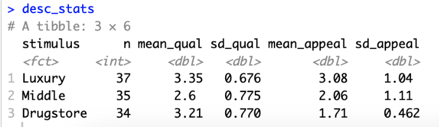
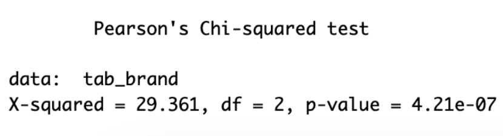
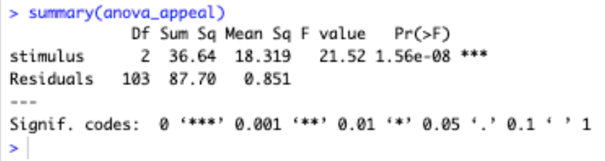
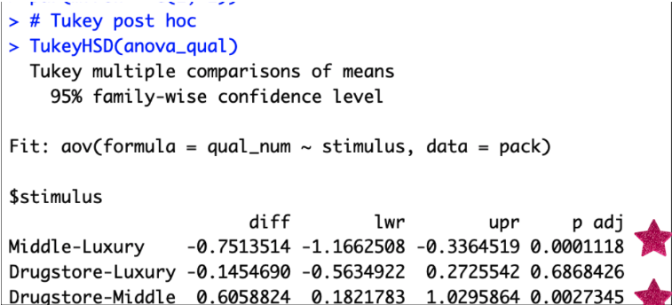

## **Overview**

In this project, our group looked at how packaging design affects people's perceptions of cosmetic products, particularly skin tint. We focused on three types of packaging: **luxury, middle, and drugstore**. Although all three images displayed the same product information, people made very different assumptions based only on how the packaging looked.

## Survey Questions & Response Summary

-   Total Qualtrics responses: 106

-   Participants viewed 1 stimulus (luxury, middle or drugstore) and rated the quality, visual, brand tier, & design elements.

|                                                                    |                              |                                                                                                                   |
|--------------------|------------------|----------------------------------|
| **Question**                                                       | **Response Type**            | **Summary of Responses**                                                                                          |
| What is your age?                                                  | Multiple choice              | Majority were 18–24 and 25–34, with very few respondents over 45.                                                 |
| What is your gender?                                               | Multiple choice              | Mostly female respondents, followed by male, with a small number of non-binary or prefer-not-to-say.              |
| What is your skin tone?                                            | Multiple choice              | Responses were spread across Light, Medium, Tan, and Deep, with Light and Medium being the most common.           |
| Rate the overall quality of this product (Luxury stimulus)         | Likert scale (1–5)           | Mean rating ≈ 3.35 (highest among the three tiers).                                                               |
| Rate how visually appealing this packaging is (Luxury stimulus)    | Likert scale (1–5)           | Mean rating ≈ 3.08; respondents viewed luxury packaging as the most appealing.                                    |
| This product looks like a… (Luxury stimulus)                       | Multiple choice              | Roughly half identified it as a luxury brand; the remainder selected everyday/non-luxury.                         |
| What elements stood out to you? (Luxury stimulus)                  | Multiple choice + open-ended | Packaging design was selected most; typography was least selected; some wrote in comments about color and layout. |
| Rate the overall quality of this product (Middle stimulus)         | Likert scale (1–5)           | Mean rating ≈ 2.60 (lowest of all three groups).                                                                  |
| Rate how visually appealing this packaging is (Middle stimulus)    | Likert scale (1–5)           | Mean rating ≈ 2.06; respondents viewed it as noticeably less appealing.                                           |
| This product looks like a… (Middle stimulus)                       | Multiple choice              | Nearly all respondents identified it as an everyday/non-luxury brand.                                             |
| What elements stood out to you? (Middle stimulus)                  | Multiple choice + open-ended | Packaging design again dominated; several wrote in comments about minimalism and lack of text.                    |
| Rate the overall quality of this product (Drugstore stimulus)      | Likert scale (1–5)           | Mean rating ≈ 3.21 (higher than mid-tier but lower than luxury).                                                  |
| Rate how visually appealing this packaging is (Drugstore stimulus) | Likert scale (1–5)           | Mean rating ≈ 1.71 (lowest of the three tiers).                                                                   |
| This product looks like a… (Drugstore stimulus)                    | Multiple choice              | The majority identified it as a luxury brand due to gold accents                                                  |
| What elements stood out to you? (Drugstore stimulus)               | Multiple choice + open-ended | Packaging design was most selected; comments mentioned dripping effect, product oozing, and layout issues.        |

## Findings:

Statistical testing included ANOVA, MANOVA & Chi-Square.

Overall, the luxury packaging received the **highest** ratings for appeal, while the middle-tier packaging received the **lowest** ratings for **both** quality and appeal. Interestingly, the drugstore packaging performed **similarly** to luxury in perceived quality, despite receiving low scores for appeal:

Chi-Squared provided confirmation with a significant p-value of importance:

#### Appeal Anova:

ANOVA was applied to the appeal of the skin tint. At a p-value of 1.56e-06, packaging design was confirmed to be a top driver for consumers making purchasing decisions.

#### Tukey Post-Hoc

ANOVA analysis can be expanded via Tukey Post-Hoc test to show the jump between packaging tiers. Findings showed that Middle-Luxury tier and Drugstore-Middle Tiers had significant differences, **reinforcing that consumers judge quality and appeal simultaneously.**

## Conclusion

-   Cosmetic design has a **strong influence** on how consumers perceive both product quality and visual appeal, even when all product information remains constant.

-   Higher quality ratings for more refined designs and lower appeal for simplistic designs, strengthens the argument that packaging design serves two purposes of functionality and emotion.

-   Minimalist or clinical design cues can come across as trustworthy even though there is a lack of an appealing aesthetic.
