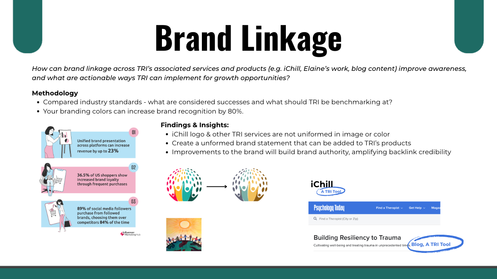
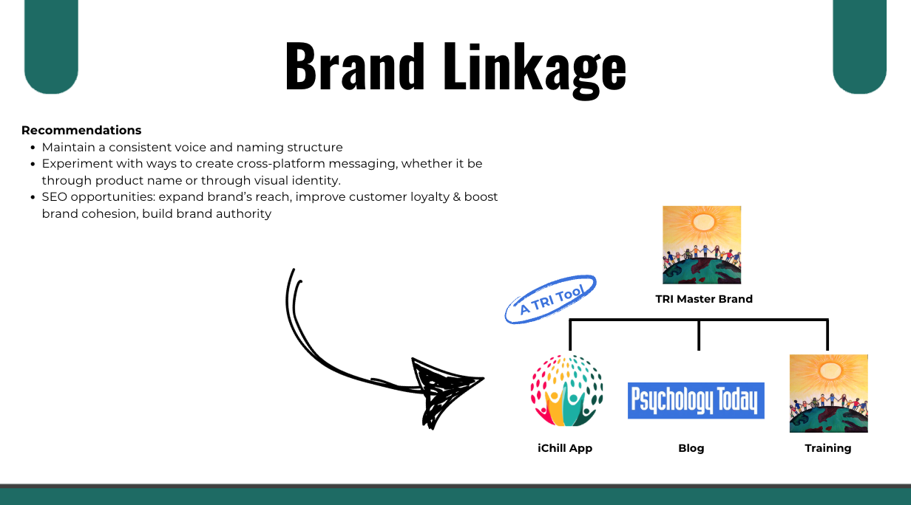

#### **Project Overview**

This project developed an off-page SEO strategy for the Trauma Resource Institute (TRI) to strengthen digital authority, improve backlink quality, and increase visibility within the mental health space. My work focused on backlink analysis, keyword opportunities, guest posting strategy, brand linkage recommendations, and partnership outreach to support long-term organic growth.

::: columns
::: {.column width="50%"}
#### **Objectives**

-   Evaluate TRI’s backlink health and toxic link risks\
-   Identify keyword and content opportunities\
-   Recommend guest posting and link exchange strategies\
-   Improve brand cohesion across TRI resources with brand linkage\
:::

::: {.column width="50%"}
#### **Key Skills Applied**

-   Off-page SEO analysis\
-   Backlink auditing\
-   Keyword research\
-   Outreach strategy\
-   Brand and partnership analysis\
:::
:::

#### **Key Findings**

-   TRI had approximately **3.3K backlinks** from **622 referring domains** with an **authority score of 27**\
-   The backlink audit identified **15 toxic domains** and **86 potentially toxic domains**\
-   Strong guest posting opportunities existed across mental health, nonprofit, and behavioral health platforms\
-   TRI’s brand ecosystem lacked consistent linkage across TRI, iChill, and related content properties

#### **Recommendations**

::: columns
::: {.column width="50%"}
-   Disavow confirmed toxic backlinks and monitor backlink health quarterly
-   Pursue backlinks from mission-aligned `.edu`, `.gov`, and high-authority mental health domains
-   Build a guest posting pipeline using existing and former TRI partners
-   Standardize brand language across TRI resources, such as “iChill, a TRI Tool”
-   Publish more consistent blog content to support both keyword visibility and backlink outreach
:::

::: {.column width="50%"}
#### **Brand Linkage**

:::
:::
